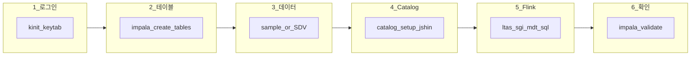

# Flink 시나리오 2 — 초급자 가이드

KT KDAP PoC에서 **Flink로 무엇을 하는지**, **어떤 순서로 실행하는지** 정리한 문서입니다.  
(CDP 7.3.2 · Flink 1.20.1 · jshin 내부 클러스터 기준)

---

## 한 줄 요약

> **통화 데이터(CDR)가 계속 들어오면**, Flink가 **5분마다 묶어서 집계**하고, 결과를 Iceberg 테이블에 저장합니다.

배치(하루치 한 번에 계산) 대신 **실시간에 가까운 방식**으로 같은 집계를 하는 것이 이 시나리오의 목표입니다.

---

## 비유로 이해하기

| 개념 | 비유 |
|------|------|
| **원본 데이터** (`cdr_sgi_raw`) | 컨베이어 벨트 위로 계속 올라오는 상자 |
| **Flink Job** | 벨트 옆에서 상자를 받아 세는 직원 |
| **5분 TUMBLE 윈도우** | 12:45~12:50, 12:50~12:55 처럼 **5분 단위 구간**으로 나눠 집계 |
| **기지국 테이블** (`bts_master`) | 상자에 붙은 코드 → 어느 지역 기지국인지 lookup |
| **결과 테이블** (`ltas_5min_flink` 등) | 5분마다 정리된 집계표 |

---

## 전체 흐름 (6단계)

```
[1] 로그인          클러스터 접속 권한 확보 (Kerberos)
      ↓
[2] 테이블 만들기   Impala로 kdap DB + 원본/결과 테이블 생성
      ↓
[3] 데이터 넣기     샘플(소량) 또는 SDV(대용량) 데이터 적재
      ↓
[4] Catalog 설정    Flink가 Iceberg 테이블을 읽을 수 있게 연결
      ↓
[5] Flink Job 실행  4개 Job 중 하나씩 (또는 동시에) 실행
      ↓
[6] 결과 확인       5~6분 후 Impala에서 집계 결과 SELECT
```



---

## Flink Job 4개 — 각각 무엇을 하나요?

PoC에서는 배치 쿼리 4개를 Flink 실시간 Job 4개로 대응합니다.

| Job | SQL 파일 | 읽는 테이블 | 쓰는 테이블 | 하는 일 |
|-----|----------|-------------|-------------|---------|
| **F-LTAS** | `ltas_5min.sql` | `cdr_sgi_raw` + `bts_master` | `ltas_5min_flink` | LTAS 트래픽 5분 집계 |
| **F-SGi-1** | `sgi_5min_v1.sql` | `cdr_sgi_raw` + `bts_master` | `sgi_5min_flink` | SGi 시그널 집계 (v1) |
| **F-SGi-2** | `sgi_5min_v2.sql` | `cdr_sgi_raw` + `bts_master` | `sgi_5min_flink_v2` | SGi 시그널 집계 (v2) |
| **F-MDT** | `mdt_5min.sql` | `cdr_mdt_smsng_raw` + `bts_master` | `mdt_5min_flink` | MDT 무선품질 5분 집계 |

**처음 테스트할 때는 F-LTAS 하나만** 실행해 보세요. 성공하면 나머지 3개를 추가합니다.

---

## Step 1 — 로그인 (클러스터 접속)

Cloudera 클러스터는 Kerberos 인증이 필요합니다. **매 터미널 세션마다** 한 번 실행하세요.

```
export HADOOP_CONF_DIR=/etc/hadoop/conf
```

```
kinit -kt /cdep/keytabs/systest.keytab systest@QE-INFRA-AD.CLOUDERA.COM
```

```
klist
```

**확인:** `klist`에 `systest@QE-INFRA-AD.CLOUDERA.COM` 티켓이 보이면 OK.

---

## Step 2 — 테이블 만들기 (Impala)

Flink가 읽고 쓸 **Iceberg 테이블**을 미리 만들어 둡니다. **최초 1회**면 충분합니다.

```
cd /path/to/KT_KDAP_Cloudera_PoC
```

```
impala-shell -i ccycloud-5.jshin.root.comops.site:25003 --protocol=beeswax -d default -k --ssl --ca_cert=/var/lib/cloudera-scm-agent/agent-cert/cm-auto-global_cacerts.pem -f flink/cdp-test/impala_01_create_tables.sql
```

**확인:**

```
impala-shell -i ccycloud-5.jshin.root.comops.site:25003 --protocol=beeswax -d default -k --ssl --ca_cert=/var/lib/cloudera-scm-agent/agent-cert/cm-auto-global_cacerts.pem -q "SHOW TABLES IN kdap"
```

`bts_master`, `cdr_sgi_raw`, `ltas_5min_flink` 등이 보이면 OK.

---

## Step 3 — 데이터 넣기

Flink는 **빈 테이블**에서는 할 일이 없습니다. 원본 데이터를 넣어야 Job이 동작합니다.

### 방법 A — 소량 샘플 (처음 연습용, 추천)

10건 미만의 테스트 데이터입니다. **Flink가 도는지** 빠르게 확인할 때 사용합니다.

```
impala-shell -i ccycloud-5.jshin.root.comops.site:25003 --protocol=beeswax -d default -k --ssl --ca_cert=/var/lib/cloudera-scm-agent/agent-cert/cm-auto-global_cacerts.pem -f flink/cdp-test/impala_02_sample_data.sql
```

### 방법 B — SDV 대용량 (부하 테스트용)

100만 건 이상의 합성 데이터입니다. 성능 테스트할 때 사용합니다.

```
python3.11 -m venv .venv && source .venv/bin/activate && pip install -r sdv/requirements.txt
```

```
python3.11 sdv/generate_flink_data.py --scale bts=5000 --scale sgi=1000000 --scale mdt=1000000
```

HDFS 업로드 및 Impala 적재 → [SDV 적재 가이드](../docs/runbooks/flink-sdv-data-load.md)

**확인:**

```
impala-shell -i ccycloud-5.jshin.root.comops.site:25003 --protocol=beeswax -d default -k --ssl --ca_cert=/var/lib/cloudera-scm-agent/agent-cert/cm-auto-global_cacerts.pem -q "SELECT COUNT(*) FROM kdap.cdr_sgi_raw"
```

1 이상이면 OK.

---

## Step 4 — YARN Session 시작 (1회)

> **Tip:** Job은 `INSERT INTO ... SELECT ...` 형태라서 제출 후 **RUNNING** 상태가 정상입니다.  
> YARN session을 **먼저 detached로 띄운 뒤**, SQL Client로 job을 제출합니다.

**사전:** `sql-client.sh` / `flink-sql-client*.jar`가 parcel에 없으면 [Flink SQL Client 보완](#flink-sql-client-보완-csa-parcel) 참고.

```
export HADOOP_CONF_DIR=/etc/hadoop/conf
kinit -kt /cdep/keytabs/systest.keytab systest@QE-INFRA-AD.CLOUDERA.COM
```

```
/opt/cloudera/parcels/FLINK/bin/flink-yarn-session -d -nm sbi-flink-sql -s 2 -tm 2048
```

YARN Application **RUNNING** 확인:

```
yarn application -list | grep sbi-flink-sql
```

---

## Step 5 — Flink SQL Job 제출 (Catalog + LTAS)

YARN session(`sbi-flink-sql`)이 떠 있는 **같은 edge 노드**에서 실행합니다.  
(`.yarn-properties`가 생성되어 있어야 SQL Client가 session에 붙습니다.)

### F-LTAS (첫 번째 Job — 여기부터 시작)

```
/opt/cloudera/parcels/FLINK/bin/flink-sql-client embedded -Djavax.net.ssl.trustStore=/var/lib/cloudera-scm-agent/agent/cert/cm-auto-global_cacerts.jks -Djavax.net.ssl.trustStorePassword=changeit -Djavax.net.ssl.trustStoreType=JKS -f flink/conf/00_catalog_setup_jshin.sql -f flink/ltas_5min.sql
```

**Job 안에서 일어나는 일 (쉬운 설명):**

1. `cdr_sgi_raw`에서 **새 데이터**를 계속 읽음 (Iceberg streaming)
2. `bts_master`와 JOIN → 기지국/지역 정보 붙임
3. `rqt_st_dt` **45분대** 데이터만 필터 (`SUBSTR(..., 11, 2) = '45'`)
4. **5분 구간**으로 묶어 SUM, COUNT
5. 결과를 `ltas_5min_flink`에 저장

### F-SGi-1 / F-SGi-2 / F-MDT (추가 Job)

**YARN session은 재시작하지 않습니다.** `kinit` 후 SQL Client만 다시 실행합니다.

**F-SGi-1:**

```
/opt/cloudera/parcels/FLINK/bin/flink-sql-client embedded -Djavax.net.ssl.trustStore=/var/lib/cloudera-scm-agent/agent/cert/cm-auto-global_cacerts.jks -Djavax.net.ssl.trustStorePassword=changeit -Djavax.net.ssl.trustStoreType=JKS -f flink/conf/00_catalog_setup_jshin.sql -f flink/sgi_5min_v1.sql
```

**F-SGi-2:**

```
/opt/cloudera/parcels/FLINK/bin/flink-sql-client embedded -Djavax.net.ssl.trustStore=/var/lib/cloudera-scm-agent/agent/cert/cm-auto-global_cacerts.jks -Djavax.net.ssl.trustStorePassword=changeit -Djavax.net.ssl.trustStoreType=JKS -f flink/conf/00_catalog_setup_jshin.sql -f flink/sgi_5min_v2.sql
```

**F-MDT:**

```
/opt/cloudera/parcels/FLINK/bin/flink-sql-client embedded -Djavax.net.ssl.trustStore=/var/lib/cloudera-scm-agent/agent/cert/cm-auto-global_cacerts.jks -Djavax.net.ssl.trustStorePassword=changeit -Djavax.net.ssl.trustStoreType=JKS -f flink/conf/00_catalog_setup_jshin.sql -f flink/mdt_5min.sql
```

---

## Step 6 — 결과 확인

Flink 5분 윈도우는 **구간이 닫혀야** 결과가 sink에 써집니다. Job 제출 후 **5~6분** 기다린 뒤 확인하세요.

```
impala-shell -i ccycloud-5.jshin.root.comops.site:25003 --protocol=beeswax -d default -k --ssl --ca_cert=/var/lib/cloudera-scm-agent/agent-cert/cm-auto-global_cacerts.pem -f flink/cdp-test/impala_03_validate.sql
```

**성공 기준:**

| 확인 | 기대 결과 |
|------|-----------|
| `ltas_5min_flink` 건수 | 1건 이상 |
| `window_end - window_start` | 5분 |
| Flink Web UI | Job 상태 **RUNNING** |
| Checkpoint | SUCCESS |

---

## (선택) Step 7 — 실행 중 데이터 추가

실시간처럼 동작하는지 보려면, Job이 **RUNNING**인 상태에서 Impala로 데이터를 추가합니다.

```
impala-shell -i ccycloud-5.jshin.root.comops.site:25003 --protocol=beeswax -d default -k --ssl --ca_cert=/var/lib/cloudera-scm-agent/agent-cert/cm-auto-global_cacerts.pem -q "INSERT INTO kdap.cdr_sgi_raw (sgi_id, cell_id, alt_cell_id, rqt_st_dt, etl_date, val, use_flag, signal_type, event_time) VALUES ('SGI999', 'CELL_A', 'CELL_A_ALT', '20260803124559', '20260803', 100, 'Y', 'SGI', NOW())"
```

```
impala-shell -i ccycloud-5.jshin.root.comops.site:25003 --protocol=beeswax -d default -k --ssl --ca_cert=/var/lib/cloudera-scm-agent/agent-cert/cm-auto-global_cacerts.pem -q "REFRESH kdap.cdr_sgi_raw"
```

> `rqt_st_dt`의 **11~12번째 글자가 `45`** 여야 Flink 필터를 통과합니다.  
> 예: `2026080312`**`45`**`00` → OK

---

## Job 중지 / 상태 확인

**Flink job 목록 (YARN session 내):**

```
/opt/cloudera/parcels/FLINK/bin/flink list
```

**Job cancel:**

```
/opt/cloudera/parcels/FLINK/bin/flink cancel <JOB_ID>
```

**YARN session 종료 (`sbi-flink-sql`):**

```
yarn application -list | grep sbi-flink-sql
yarn application -kill <application_id>
```

또는 Cloudera Manager → Flink → **Web UI** → Running Jobs → Cancel

---

## Flink SQL Client 보완 (CSA parcel)

jshin parcel에 `lib/flink/bin/sql-client.sh` 및 `flink-sql-client*.jar`가 없으면 Apache Flink **1.20.1** binary에서 복사:

```
cp flink-1.20.1/bin/sql-client.sh /opt/cloudera/parcels/FLINK/lib/flink/bin/
cp flink-1.20.1/opt/flink-sql-client-*.jar /opt/cloudera/parcels/FLINK/lib/flink/opt/
cp flink-1.20.1/opt/flink-sql-gateway-*.jar /opt/cloudera/parcels/FLINK/lib/flink/opt/
chmod +x /opt/cloudera/parcels/FLINK/lib/flink/bin/sql-client.sh
```

---

## 자주 막히는 곳

| 증상 | 원인 | 해결 |
|------|------|------|
| Permission denied | Kerberos 만료 | `kinit` 다시 실행 |
| 테이블 없음 | Step 2 미실행 | `impala_01_create_tables.sql` 실행 |
| 결과 0건 | 데이터 없음 / 분 필터 | Step 3 데이터 확인, `rqt_st_dt` 45분대 확인 |
| 결과 0건 | 윈도우 미완료 | 5~6분 더 대기 |
| HDFS 오류 | nameservice | `export HADOOP_CONF_DIR=/etc/hadoop/conf` |
| Catalog 오류 | HMS 연결 | `00_catalog_setup_jshin.sql` URI 확인 |
| SQL Client 실패 | `sql-client.sh` 없음 | 위 [Flink SQL Client 보완](#flink-sql-client-보완-csa-parcel) |
| Job 제출 실패 | YARN session 없음 | `flink-yarn-session -d -nm sbi-flink-sql ...` 재실행 |

---

## 파일 위치 정리

| 용도 | 경로 |
|------|------|
| **이 가이드** | `flink/README.md` |
| 명령어 전체 복사 | [flink/cdp-test/COMMANDS.md](cdp-test/COMMANDS.md) |
| 환경 설정 | [docs/runbooks/env-setup.md](../docs/runbooks/env-setup.md) |
| SDV 대용량 데이터 | [sdv/README.md](../sdv/README.md) |
| Catalog SQL | [flink/conf/00_catalog_setup_jshin.sql](conf/00_catalog_setup_jshin.sql) |
| 테이블 DDL | [flink/cdp-test/impala_01_create_tables.sql](cdp-test/impala_01_create_tables.sql) |
| 샘플 데이터 | [flink/cdp-test/impala_02_sample_data.sql](cdp-test/impala_02_sample_data.sql) |
| 결과 검증 | [flink/cdp-test/impala_03_validate.sql](cdp-test/impala_03_validate.sql) |

---

## 추천 학습 순서 (초급자)

1. **Step 1~2** — 로그인 + 테이블 생성 (Impala만 사용, Flink 없음)
2. **Step 3 방법 A** — 샘플 6건 넣기
3. **Step 4+5 F-LTAS만** — Job 1개 실행
4. **Step 6** — 5분 후 결과 확인
5. **Step 7** — 데이터 추가 후 결과 변화 관찰
6. **F-SGi, F-MDT** — Job 3개 추가
7. **SDV 대용량** — 성능 테스트

문의: Flink PS **신정훈** / 튜닝 **박소희, 이지환**
